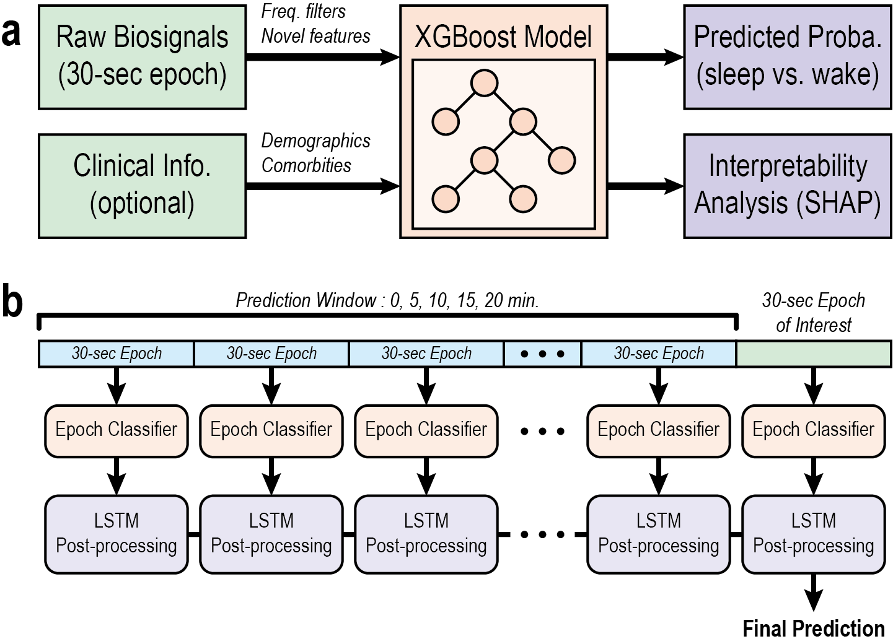

# **(CS 598) Deep Learning for Healthcare: Final Project**

## **📖 Overview of the Project**

### **1. Introduction**

This repository is the implementation of the final project for **(CS 598) Deep Learning for Healthcare**, Spring 2025 term.

In this work, we utilized a publicly available [dataset](https://physionet.org/content/dreamt/2.0.0/) related to sleep disorders, introduced in [this study](https://raw.githubusercontent.com/mlresearch/v248/main/assets/wang24a/wang24a.pdf).

The citation to the original paper is as follows:
```
@inproceedings{wang2024addressing,
  title={Addressing wearable sleep tracking inequity: a new dataset and novel methods for a population with sleep disorders},
  author={Wang, Will Ke and Yang, Jiamu and Hershkovich, Leeor and Jeong, Hayoung and Chen, Bill and Singh, Karnika and Roghanizad, Ali R and Shandhi, Md Mobashir Hasan and Spector, Andrew R and Dunn, Jessilyn},
  booktitle={Proceedings of the fifth Conference on Health, Inference, and Learning (Proceedings of Machine Learning Research, Vol. 248), Tom Pollard, Edward Choi, Pankhuri Singhal, Michael Hughes, Elena Sizikova, Bobak Mortazavi, Irene Chen, Fei Wang, Tasmie Sarker, Matthew McDermott, and Marzyeh Ghassemi (Eds.). PMLR},
  pages={380--396},
  year={2024}
}
```

### **2. What's Already Done?: A Brief Summary of the Original Paper**

The original paper proposes a machine learning framework that classifies a person's sleep state, using continuous measurements from a wearable device.

They leverage GPBoost and LightGBM to develop an ***Epoch Classifier*** which classifies a 30-second ***"Epoch"*** into either a ***"SLEEP"*** or ***"WAKE"*** state.

Furthermore, they introduce...

* An ***LSTM-Based Post-Processing*** module to allow the integration of long-range temporal relations
 
* The use of ***Clinical Information*** such as obesity and sleep apnea status to enhance classification peroformance.
 
As a result, 6 different models were trained, and their performance is shown below:

| Random Effects   | LSTM post-processing | AUROC               | F1 Score              |
|:----------------:|:--------------------:|:-------------------:|:---------------------:|
| None             | No                   | 0.895 ± 0.007       | 0.777 ± 0.009         |
| Obesity          | No                   | 0.902 ± 0.015       | 0.785 ± 0.020         |
| Apnea Severity   | No                   | 0.898 ± 0.016       | 0.782 ± 0.015         |
| None             | Yes                  | 0.915 ± 0.019       | 0.805 ± 0.025         |
| Obesity          | Yes                  | 0.926 ± 0.011       | 0.822 ± 0.019         |
| Apnea Severity   | Yes                  | **0.926 ± 0.016**   | **0.823 ± 0.019**     |


### **3. What's New?: Our Efforts to Extend the Research**

For the final project, we take three different approaches to extend the results of the original paper

(1) First, we integrate ⭐***various clinical features***⭐ other than just obesity and apnea severity. Demographics such as age and sex, as well as comorbidity status (chronic diseases, psychological disorders, gastroesophageal reflux disease, etc.) are further included.

(2) Second, we perform a series of ⭐***SHAP analyses to quantitatively asssess the Epoch Classifier's interpretability***⭐. This was done in search for evidence for the justification of adding clinical features, which, unfortunately, turned out to be unsuccessful.

(3) Thirdly, we explored the ⭐***impact of window sizes on model performance***⭐ when developing LSTM-based post-processing modules.

The summary of the final project is given as follows:




## **📊 Sample Dataset**

This section describes a sample dataset provided in the repository as a brief example.

### **1. Clinical Information**

Two sample patients, each with sample ID (SID) of "SLEEP" and "WAKE", are provided. Their clinical information is provided in `dataset/clinical_info_onehot.csv`

|  SID   |  AGE  | GENDER |  BMI  | Anxiety | Arrhythmia | Asthma | Body Pain | CAD | Depression | Diabetes | Dyspnea | GERD | Hypertension | Migraine |
|:------:|:-----:|:------:|:-----:|:-------:|:----------:|:------:|:---------:|:---:|:----------:|:--------:|:-------:|:----:|:------------:|:--------:|
| SLEEP  | 29.38 |   1    | 51.0  |    0    |     0      |   0    |     0     |  0  |     0      |    0     |    0    |  0   |      0       |    0     |
| WAKE   | 49.12 |   0    | 43.0  |    0    |     0      |   1    |     1     |  0  |     1      |    1     |    1    |  1   |      0       |    0     |


### **2. Raw Measurement Signal Data**

The raw measurement signal data are provided in `dataset/raw/<SID>.csv`, where `SID` is either `SLEEP` or `WAKE`. The signals are recorded continuously at a sample rate of 64 Hz, and the sleep state label is provided in a binary fashion, where 0 and 1 represent sleep and wake state, respectively.


## **✏️ Code Implementation**

### **1. Specification of Dependencies**

Clone this repository and create a new conda environment by running this command:

```
conda env create --file environment_dlh.yaml
conda activate DLH
```
For those in a rush, you may skip the following sections and go to ▶️***5. Putting Them All Together***◀️

### **2. Data Preprocessing**

First, we need to slice the raw signal(s) into epochs of 30 seconds in length. The following code generates a new directory `dataset/preproc/<SID>` and saves a series of sliced signals and a summary of the signals. Please refer to `utils.py` to examine how the features were engineered. It should be noted that ⚠️***the code provided by the original authors did not work properly***⚠️, so the preprocessing script had to be written from scratch.

```
python3 data_preprocess.py --sid=<SID>
```

### **3. Run Epoch Classifier**
`run_epoch_clf.py` implements the XGBoost model that classifies the 30-second epochs of device measurement data. `CI=False` model takes features derived from BVP, EDA, TEMP, IBI, and ACC and `CI=True` model takes additional clinical features related to the patient. Running the following code will generate a temporary file in `model/postproc`, which will be necessary to execute the next stage successfully.

```
python3 run_epoch_clf.py --sid=<SID> --clinical_info=<True/False>
```


### **4. Run LSTM Post-Processing Module**

`run_post_lstm.py` implements the LSTM post-processing process, and the weights for each window size of 5, 10, 15, and 20 minutes for each of the five folds are provided in `model/post_LSTM_WIN=<WINDOW_SIZE>_CI=<True/False>` directories. Upon executing the following code, the results are generated in a new directory named `result` as a `.csv` file. This consists of the output probabilities of the epoch classifier and post-processed probabilities.

```
python3 run_post_lstm.py --sid=<SID> --clinical_info=<True/False> --window_size=<WINDOW_SIZE>
```


### **5. Putting Them All Together**

The epoch classification and post-processing algorithms are packed into a single script, so for those who want to process their data quickly, one can simply run the following code:

```
python3 run_full_model.py --sid=<SID> --clinical_info=<True/False> --window_size=<WINDOW_SIZE>
```


## **📐 Results**

* ***Copy table & Figure(s) from final report***


## **👏 Contributions**

My NetID is `wounsuk2`, and as this is a solo team, the conceptualization, model development, and writing of the final report was solely done by Wounsuk Rhee.
